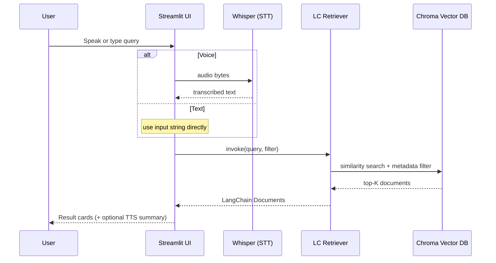
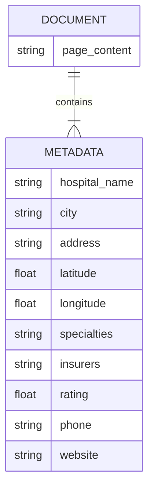

# 🩺 Hospital Voice Nearby — LangChain + Voice

This project is a multilingual, voice-enabled hospital finder built with **Streamlit**, **LangChain**, and **Whisper**.  
It lets users search nearby hospitals using voice or text, with advanced metadata filters for city, specialty, and insurer.

---

## ⚙️ Tech Stack

| Layer | Library | Purpose |
|-------|----------|----------|
| Vector Store | **LangChain-Chroma** | Persistent vector DB for hospital embeddings |
| Embeddings | **LangChain-HuggingFace** | SentenceTransformer (MiniLM-L6-v2) for text → vector conversion |
| Document Model | **LangChain Document** | Standard container for text + metadata |
| Retriever | **LangChain Runnable Retriever** | Semantic + filtered search |
| Frontend | **Streamlit** | Web UI with voice & dropdown filters |
| Speech-to-Text | **Whisper** | Converts audio input to text |
| Text-to-Speech | **gTTS** | Generates spoken response summaries |

---

## 🧠 How LangChain Works Here

### 1️⃣ Embedding Creation

Every hospital row from `data/hospitals.csv` is converted to a LangChain `Document`:

```python
from langchain.docstore.document import Document

doc = Document(
    page_content="Apollo Hospital in Jaipur offers cardiology and orthopedics.",
    metadata={
        "hospital_name": "Apollo Hospital",
        "city": "Jaipur",
        "specialties": "cardiology|orthopedics",
        "insurers": "HDFC Ergo|ICICI Lombard",
        "rating": 4.5
    }
)
```

Each document is embedded with:

```python
from langchain_huggingface import HuggingFaceEmbeddings
embeddings = HuggingFaceEmbeddings(model_name="sentence-transformers/all-MiniLM-L6-v2")
```

---

### 2️⃣ Vector Store (Chroma)

The embeddings are stored using **LangChain-Chroma**:

```python
from langchain_chroma import Chroma
vs = Chroma(embedding_function=embeddings, persist_directory="storage/chroma")
vs.add_documents(documents)
```

- Auto-persists vectors on disk (`storage/chroma`)
- Handles upserts and fast retrieval
- Ingestion runs in safe batches (<166 docs) to avoid API size limits

---

### 3️⃣ Retriever Setup

A retriever wraps the vector store for semantic search:

```python
retriever = vs.as_retriever(search_kwargs={"k": 5})
```

With filters:

```python
meta_filter = {
    "city": {"$eq": "Jaipur"},
    "specialties": {"$contains": "cardiology"},
    "insurers": {"$contains": "HDFC Ergo"}
}
retriever = vs.as_retriever(search_kwargs={"k": 5, "filter": meta_filter})
```

---

### 4️⃣ Query Execution

LangChain 0.3+ uses the Runnable interface:

```python
docs = retriever.invoke("best cardiology hospitals")
```

Older versions fallback:

```python
docs = retriever.get_relevant_documents("best cardiology hospitals")
```

---

### 5️⃣ Result Processing

Results are LangChain `Document` objects.  
Their `metadata` fields are displayed as Streamlit cards:

```python
for doc in docs:
    meta = doc.metadata
    st.write(f"🏥 {meta['hospital_name']} ({meta['city']}) — ⭐ {meta['rating']}")
```

---

### 6️⃣ Filters via Metadata

The sidebar filters dynamically apply to LangChain’s Chroma layer:

```python
{"city": {"$eq": "Jaipur"}, "specialties": {"$contains": "neurology"}}
```

This executes *inside the vector store* before semantic ranking.

---

### 7️⃣ Voice Pipeline

- `Whisper` transcribes speech → query text.
- The query passes through the **LangChain retriever**.
- `gTTS` optionally speaks the summarized answer.

---

## 🧩 Directory Overview

```
hospital-voice-nearby/
│
├── app.py                       # Streamlit frontend
├── data/hospitals.csv            # Input dataset
├── app/services/
│   ├── lc_vector.py              # LangChain embeddings + Chroma retriever
│   └── retrieval.py              # Metadata filters + LangChain search
├── scripts/
│   └── ingest.py                 # LangChain ingestion to Chroma
└── storage/chroma/               # Persistent vector DB
```

---

## 🚀 Quick Start

```bash
pip install -r requirements_langchain.txt
pip install -U langchain-huggingface langchain-chroma streamlit pandas openai-whisper gTTS
python -m scripts.ingest
streamlit run app.py
```

Then open the app → try voice search:  
🎙️ “Find cardiology hospitals in Jaipur covered by HDFC Ergo”

---

## 🧩 LangChain in Action Summary

| Step | Component | LangChain Role |
|------|------------|----------------|
| 1 | Document creation | `langchain.docstore.document.Document` |
| 2 | Embedding | `langchain_huggingface.HuggingFaceEmbeddings` |
| 3 | Vector DB | `langchain_chroma.Chroma` |
| 4 | Retriever | `.as_retriever()` |
| 5 | Filtering | `Chroma` metadata filter (`$eq`, `$contains`) |
| 6 | Query | `.invoke(query)` |
| 7 | Output | List of LangChain `Document`s |
| 8 | Display | Streamlit cards render metadata |

---

## 🧭 Architecture (LangChain data flow)

```mermaid
flowchart TD
    subgraph Ingestion["Ingestion (one-time or whenever CSV changes)"]
        A[CSV: data/hospitals.csv] --> B[LangChain Documents<br/>page_content + metadata]
        B --> C[HuggingFaceEmbeddings<br/>(MiniLM-L6-v2)]
        C --> D[Chroma (persistent)<br/>storage/chroma]
        B -. metadata (city, specialties, insurers) .-> D
    end

    subgraph App["Runtime (Streamlit UI)"]
        E[User Input<br/>Text or Voice] --> F{Whisper?}
        F -- Voice --> G[Whisper STT<br/>speech → text]
        F -- Text --> H[Raw query text]
        G --> I[Query Text]
        H --> I[Query Text]
        I --> J[LangChain Retriever<br/>Chroma.as_retriever(k, filter)]
        K[Sidebar Filters<br/>City / Specialty / Insurer] --> L[Metadata Filter JSON<br/>{ city:$eq, specialties:$contains, insurers:$contains }]
        L --> J
        J --> M[Top-K Documents]
        M --> N[Streamlit Cards<br/>name, city, rating, etc.]
        M -. optional --> O[gTTS TTS<br/>spoken summary]
    end
```

---

## 🔁 Query-time sequence (detailed)



---

## 🧩 Document Schema (Mermaid ER)



---

### 👨‍💻 Maintainer

**Naman Goyal**  
AI Engineer @ Deutsche Bank India  
Building multilingual, voice-enabled AI assistants using LangChain, Whisper, and Streamlit.

